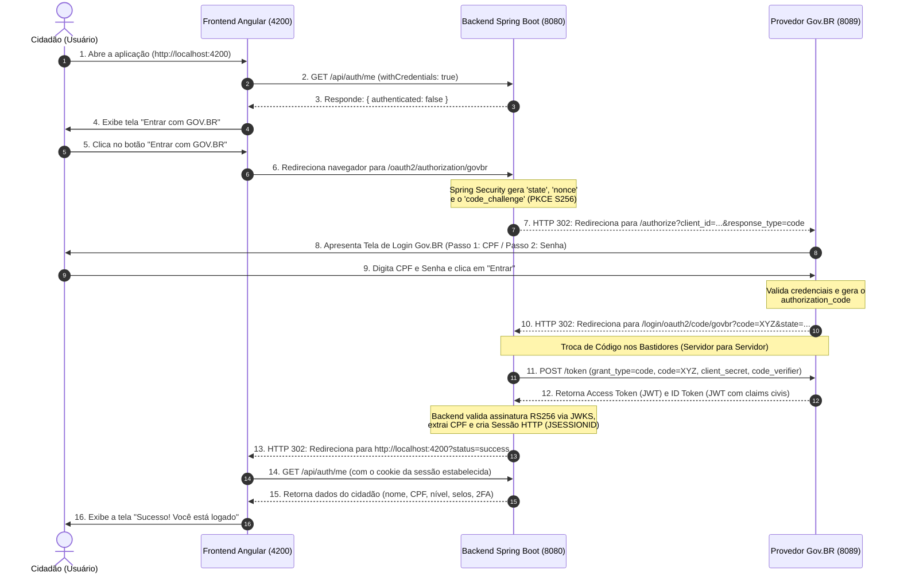

# Guia de Integração: Angular + Spring Boot + Gov.BR (OAuth2 / OpenID Connect)

Este documento explica de forma clara e detalhada como funciona a arquitetura de autenticação implementada no projeto **mock-br-test-front**, desmistificando a mecânica de integração de uma Single Page Application (SPA) em Angular com o fluxo **OAuth2 / OpenID Connect (OIDC)** do Gov.BR.

---

## 1. O Problema Fundamental: Por que o Angular não faz login direto no Gov.BR?

Uma dúvida muito comum de quem começa a integrar aplicações modernas em Angular, React ou Vue com o Gov.BR é:

> *"Por que o meu frontend Angular não pode simplesmente chamar o endpoint `/token` do Gov.BR, pegar o token e salvar no LocalStorage?"*

### O Motivo de Segurança: Clientes Públicos vs. Confidenciais

1. **O Gov.BR exige Segredo de Cliente (`client_secret`):**
   * Para emitir tokens que dão acesso a dados civis do cidadão (CPF, foto, nível de confiabilidade), o Gov.BR exige que a aplicação comprove quem ela é através de um par de credenciais: **`client_id`** e **`client_secret`**.
2. **O Navegador é um Ambiente Público e Inseguro:**
   * Qualquer código JavaScript que roda no navegador do usuário pode ser inspecionado via *DevTools* (F12). Se o Angular guardasse o `client_secret` para chamar o Gov.BR diretamente, qualquer usuário ou extensão maliciosa poderia roubar a credencial da sua organização.
3. **Padrão Arquitetural Recomendado (BFF - Backend For Frontend):**
   * O **Backend (Spring Boot)** atua como o **OAuth2 Client Confidencial**. Ele guarda o `client_secret` protegido no servidor e troca o código de autorização diretamente com o Gov.BR.
   * O **Frontend (Angular)** nunca enxerga tokens brutos ou segredos governamentais; ele apenas gerencia a experiência visual do usuário e se comunica com o Backend por meio de uma **sessão autenticada segura** (cookie HTTP-only).

---

## 2. Visão Geral das Três Aplicações

O ecossistema local foi estruturado em três papéis complementares:

```
+----------------------------------------------------------------------------------+
|                                    NAVEGADOR                                     |
|                                                                                  |
|   [ 1. Angular SPA (Porta 4200) ]                                                |
|        Exibe as telas: "Entrar com GOV.BR" e "Sucesso! Você está logado"         |
+--------------------------+---------------------------------+---------------------+
                           |                                 |
         Sessão HTTP com   |                                 | Redirecionamento 302
         Cookies de Sessão |                                 | para autenticação
         (CORS Seguro)     |                                 |
                           v                                 v
+-------------------------------------+   +----------------------------------------+
| 2. Backend Spring Boot (Porta 8080) |   | 3. Provedor Gov.BR Mock (Porta 8089)   |
|                                     |   |                                        |
| - OAuth2 Client Confidencial        |   | - Simula o Login Único Oficial         |
| - Guarda o client_secret            |   | - Tela de Login CPF + Senha            |
| - Troca o 'code' pelo token (M2M)   |   | - Emite Access Token e ID Token RS256  |
| - Cria a sessão do usuário          |<->| - Valida PKCE e expõe JWKS pública     |
+-------------------------------------+   +----------------------------------------+
                  ^                                          ^
                  |=========== Canal Seguro M2M =============|
                              (Token Exchange)
```

---

## 3. O Passo a Passo do Fluxo de Login (Diagrama de Sequência)

Abaixo está o ciclo de vida completo de um login bem-sucedido:



---

## 4. Arquivos do Frontend e Suas Responsabilidades

No projeto **mock-br-test-front**, a estrutura é propositalmente concisa, utilizando **Angular 18 com Standalone Components**:

### 1. `src/app/app.component.ts` (Lógica de Orquestração)
É o cérebro do frontend. Ele gerencia o estado da autenticação e as chamadas REST:
* **Interface `UserSession`:**
  * Define o contrato estrito de dados que o backend fornece:
    ```typescript
    export interface UserSession {
      authenticated: boolean;
      cpf?: string;
      name?: string;
      social_name?: string;
      email?: string;
      phone_number?: string;
      nivel?: string;
      reliability_info?: {
        level: string;
        reliabilities: { id: string; updatedAt: string }[];
      };
      reliabilities?: string[];
      amr?: string[];
      mfa_verified?: boolean;
    }
    ```
* **Método `ngOnInit()`:**
  * Verifica se o navegador retornou de um redirecionamento com parâmetros de URL (`?status=success` ou `?status=error`).
  * Em seguida, dispara `checkSession()`.
* **Método `checkSession()`:**
  * Faz uma chamada `GET http://localhost:8080/api/auth/me`.
  * **Ponto Crítico:** utiliza `{ withCredentials: true }`. Isso instrui o navegador a incluir automaticamente os cookies de sessão (`JSESSIONID`) criados pelo Spring Boot durante o handshake OAuth2.
* **Método `login()`:**
  * Executa `window.location.href = 'http://localhost:8080/oauth2/authorization/govbr'`.
  * Ao fazer essa navegação completa, o Angular passa o controle para o Spring Security, que orquestra a ida ao Gov.BR sem que o frontend precise lidar com URLs complexas de autorização.
* **Método `logout()`:**
  * Dispara `POST http://localhost:8080/api/auth/logout` para que o backend encerre a sessão e invalide o cookie.

---

### 2. `src/app/app.component.html` (Interface com o Usuário)
Renderiza as 4 telas de acordo com o estado (`status`):
1. **Carregando (`status === 'loading'`):** Exibe um spinner enquanto verifica se já existe sessão ativa.
2. **Não Autenticado (`status === 'unauthenticated'`):** Apresenta o banner de boas-vindas com o botão oficial **"Entrar com GOV.BR"**.
3. **Sucesso (`status === 'success'`):** Exibe o painel completo do cidadão autenticado:
   * Nome Civil e Nome Social (quando existente);
   * CPF formatado (`000.000.000-00`);
   * Contatos (E-mail e Telefone nacional com DDD);
   * Badge do Nível da Conta Gov.BR (*Ouro*, *Prata* ou *Bronze*);
   * Status do Segundo Fator (*2FA utilizado vs. Apenas senha*);
   * Relação detalhada dos selos oficiais de confiabilidade com seus IDs e carimbos de data/hora;
   * Botão de encerramento de sessão (*Sair*).
4. **Erro (`status === 'error'`):** Exibe alerta visual caso ocorra alguma falha na autenticação.

---

### 3. `src/app/app.component.css` (Identidade Visual Gov.BR)
* Aplica o padrão de cores do Governo Federal:
  * Azul principal: `#1351b4`
  * Azul escuro (Header): `#0c326f`
  * Amarelo Ouro: `#f59e0b`
  * Cinza Prata: `#64748b`
  * Marrom Bronze: `#b45309`
* Estiliza crachás de confiabilidade e status de 2FA.

---

### 4. `src/main.ts` (Configuração da Aplicação)
* Inicializa o componente raiz standalone (`AppComponent`).
* Registra o `provideHttpClient(withFetch())` para suporte moderno a requisições assíncronas no browser.

---

## 5. Como o Backend (`mock-br-test-back`) Apoia o Angular

Para que o Angular funcione de forma tão transparente, o backend em Spring Boot realiza três tarefas essenciais:

1. **Configuração OAuth2 Automática (`application.yml`):**
   * Aponta para o `mock-br` (`http://localhost:8089`) como provedor de identidade.
   * O Spring Boot baixa automaticamente as configurações em `/.well-known/openid-configuration` e as chaves públicas em `/jwks.json`.
2. **CORS com Credenciais (`CorsConfig.java`):**
   * Configura `allowedOrigins("http://localhost:4200")` e `allowCredentials(true)`.
   * Sem isso, o navegador bloquearia o envio do cookie `JSESSIONID` do Angular para o Spring Boot devido à política de mesma origem (*Same-Origin Policy*).
3. **Redirecionamento Pós-Login (`SecurityConfig.java`):**
   * Configura `.defaultSuccessUrl("http://localhost:4200?status=success", true)`.
   * Assim que o login no Gov.BR termina e o token é validado, o Spring Boot redireciona o cidadão de volta para a tela do Angular.
4. **Endpoint Seguro `/api/auth/me` (`AuthController.java`):**
   * Recupera o objeto `OidcUser` da sessão do Spring Security e formata um JSON amigável contendo CPF, nome, nível, selos numéricos e a informação se o usuário usou 2FA (`amr.contains("mfa")`).

---

## 6. O que muda quando formos para o Gov.BR Real (Staging / Produção)?

Esta é a maior vantagem da arquitetura implementada:

> **No Frontend Angular:** **NENHUMA LINHA DE CÓDIGO PRECISA SER ALTERADA!**

O frontend continua apenas chamando `/api/auth/me` e redirecionando para `/oauth2/authorization/govbr`.

### O que muda no Backend (`application.yml`):
Apenas as propriedades de conexão com o Governo Federal são atualizadas:

```yaml
spring:
  security:
    oauth2:
      client:
        registration:
          govbr:
            client-id: SEU_CLIENT_ID_FORNECIDO_PELO_GOVBR
            client-secret: SEU_CLIENT_SECRET_FORNECIDO_PELO_GOVBR
            redirect-uri: "{baseUrl}/login/oauth2/code/{registrationId}"
            authorization-grant-type: authorization_code
            scope:
              - openid
              - email
              - profile
              - phone
              - govbr_confiabilidades
              - govbr_confiabilidades_idtoken
        provider:
          govbr:
            # Em Homologação:
            issuer-uri: https://sso.staging.acesso.gov.br
            # Em Produção:
            # issuer-uri: https://sso.acesso.gov.br
```

---

## 7. Como Executar e Testar o Ecossistema Completo

Na raiz do projeto (`c:\Magno\Projetos\DELFOS`), utilize os scripts `.bat` criados para compilar e iniciar os serviços em ordem:

1. **Terminal 1 (Mock Gov.BR - Porta 8089):**
   ```cmd
   iniciar-1-mock-br.bat
   ```
2. **Terminal 2 (Backend Consumidor - Porta 8080):**
   ```cmd
   iniciar-2-test-back.bat
   ```
3. **Terminal 3 (Frontend Angular - Porta 4200):**
   ```cmd
   iniciar-3-test-front.bat
   ```

Acesse **`http://localhost:4200`** no navegador:
* Clique em **"Entrar com GOV.BR"**.
* Você será levado à tela do Gov.BR (com o banner oficial à esquerda).
* Digite um dos CPFs cadastrados (ex: `111.222.333-44`) e clique em **Continuar**.
* Na tela seguinte, digite a senha (`123`) e clique em **Entrar**.
* Você retornará automaticamente para o Angular com a mensagem: **"Sucesso! Você está logado"** e todos os seus dados e selos exibidos em tela.
